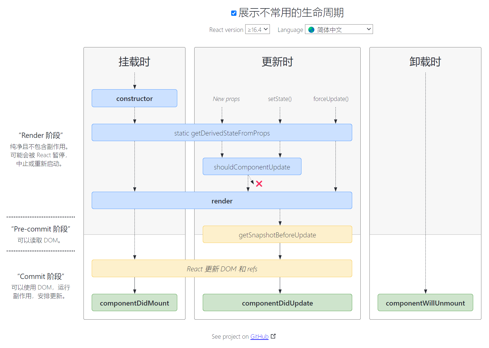

### React是什么？
  `JavaScript UI`库, 只关注`UI`层,声明式和函数式风格, 虚拟`DOM`,使前端程序更高效
   
### 特性
1. 组件化
2. 单项数据流
3. 声明式编程和函数式编程
4. 虚拟`DOM`
5. `JSX`语法
   
### 优势
1. 高效灵活
2. 声明式设计,使用简单
3. 组件化, 代码复用率高

### 真实DOM与虚拟DOM

- `reactDOM`是真实`DOM`
- `React`中使用`JSX`语法创建虚拟`DOM`
- 虚拟`DOM`本质是`JavaScript`对象
- `JSX`会被`Babel`转换为`React.createElement()`
  ```
  const HELE = <h1>haha</h1>
  ReactDOM.render(HELE, document,getElementById('app'))
  
  // 第一个参数是标签名,第二个参数是属性,第三个参数是文本
  React.createElement('h1', { class: 'test1' }, 'haha')
  
  ```

### 优缺点

  真实`DOM`的优势

  - 易用

  缺点: 效率低, 内存占用高, 频繁操作导致不断重绘和回流

  虚拟`DOM`的优势

  - 效率高 
  - 大规模应用维护简单
  - 不会因频繁操作导致不断重绘和回流
 - ` React`跨平台

  缺点
  - 首次渲染因为有虚拟`DOM`这一次处理, 速度稍慢
  - 性能要求高的应用无法极致优化
  

##` React`生命周期

`React`生命周期是`React`组件从创建->初始化数据->编译模板->挂载`DOM`-渲染,更新-渲染,卸载的过程

  ```
  // 挂载阶段
  constructor()
  static getDerivedStateFromProps()
  render()
  componentDidMount()

  // 更新阶段
  static getDerivedStateFromProps()
  shouldComponentUpdate()
  render()
  getSnapshotBeforeUpdate()
  componentDidUpdate()

  // 卸载阶段
  componentWillUnMount()

  ```



##` React`中的`setState`的执行机制

1. 异步更新
2. 同步更换

- 异步更新
  ```
  this.setState({
    name: 'k'
  }, () => {
    console.log(this.state.name) // k
  })
  ```
- 同步更新
  ```
  setTimeout(() => {
    this.setState({
      count: this.state.count + 1
    })
    console.log(this.state.count) // 2
  }, 0)

  document.getElementById('btn').addEventListener('click', () => {
    this.setState({
      count: this.state.count + 1
    })
    console.log(this.state.count) // 2
  })
  ```

  - 在组件生命周期和`React`合成事件中, `setState`是异步
  - 在`setTimeout`或原生事件中, `setState`是同步
3. 批量更新
   ```
    this.setState({
      count: this.state.count + 1
    })
    this.setState({
      count: this.state.count + 1
    })
    this.setState({
      count: this.state.count + 1
    })
   ``` 
  后面的会覆盖前面的, 最终的到`count`打印是1 页面展示是2, `setState`传入一个函数解决覆盖的问题

    ```
    this.setState((prevState, props) => ({ count: prevState.count + 1 }))
    this.setState((prevState, props) => ({ count: prevState.count + 1 }))
    this.setState((prevState, props) => ({ count: prevState.count + 1 }))
    ```

## React事件机制

- `React`事件机制是基于浏览器事件机制实现的一套机制->合成事件
- `React`上注册的事件最终会绑定在`Document`上, 减少内存开销
- 自身实现了一套事件冒泡机制
- 有一套自己的合成事件
  
## React中构建组件的方式

- 函数式创建
- 继承`React.Component`
- `React.createClass(createElement)`

## React组件通讯

- 父子 `props`
- 子父 `this.props.callback`
- 子子 通过父间接通讯
- 父-多代 `context`
- 非关系组件 `Redux`等
  ```
  // 父
  const PRICE = React.createContext('k')
  <PRICE.Provider value='haha'>
  </PRICE.Provider>

  // 后代
  <PRICE.Consumer>
  {
    price => <div>{price}</div>
  }
  </PRICE.Consumer>

  // 或者
  static contextType = PRICE
  render() {
    let price = this.context
    ...
  }
  ```

  ## React中key的作用

  - 用于判断元素是新创建还是被增删改的元素, 从而减少不必要的`Diff`
  - 性能优化
  - key是唯一的, key不要用随机数, 避免使用index作为key

  ## React中refs的作用
  - 访问DOM
  - 访问组件实例
  
  1. 控制DOM元素焦点
  2. 集成第三方DOM库
  3. 控制视频媒体内容播放,元素内容设置

  ## React高阶组件

  接收一个或多个组件, 返回一个新组件

  场景:
  - 日志记录
  - 数据校验
  - 统计上报
  - 权限控制
  - ...

## Redux

  ```
  const { createStore } from 'redux'

  const reducer = (state, action) => {}

  const store = createStore(reducer)

  store.dispatch({})
  
  store.subscribe(() => {
    store.getState()
  })
  ```
  


  

